# INFORME LABORATORIO 10

## Tabla de Contenidos

1. [Introducción](#1-introducción)
2. [Metodología](#2-metodología)
3. [Resultados](#3-resultados)
4. [Discusión](#4-discusión)
5. [Conclusión](#5-conclusión)
6. [Bibliografía](#6-bibliografía)

## 1. Introducción

El análisis de señales EEG es esencial en la investigación en neurociencia; sin embargo, el EEG multicanal presenta a menudo resultados difusos de la actividad cerebral, lo que dificulta el análisis de estos datos [1]. El filtrado espacial se emplea para separar la señal deseada de las fuentes de ruido y artefactos, mejorando la relación señal-ruido (SNR) mediante la reducción de artefactos [2][3].

El análisis de componentes independientes (ICA, por sus siglas en inglés) es una técnica utilizada para transformar vectores aleatorios multidimensionales observados en componentes estadísticamente lo más independientes posible entre sí, siendo aplicada en campos como la separación ciega de fuentes y la extracción de características [4]. Frente a otros tipos de filtrado espacial, el ICA presenta ventajas para separar componentes independientes y artefactos de la señal deseada, además de ser fácil de personalizar según la señal con la que se trabaja [5][6].

En este laboratorio se procesaron seis registros de EEG adquiridos con el dispositivo BITalino en distintas condiciones (reposo con ojos cerrados, apertura de ojos, artefactos inducidos y escucha de música, entre otras). En lugar de aplicar ICA directamente sobre los canales de EEG, se utilizó una estrategia de descomposición basada en la Descomposición Modal Empírica (EMD, *Empirical Mode Decomposition*), que separa la señal en Funciones de Modo Intrínseco (IMFs), tratadas posteriormente como pseudo-canales sobre los cuales se aplicó ICA (FastICA). La identificación de componentes artefactuales se realizó mediante un criterio cuantitativo de curtosis, dado que las componentes con distribuciones muy alejadas de la normalidad (curtosis elevada en valor absoluto) suelen corresponder a artefactos transitorios como parpadeos o movimientos musculares [7].

## 2. Metodología

### 2.1. Dataset y adquisición

Las señales de EEG se adquirieron con el dispositivo **BITalino**, a una frecuencia de muestreo **FS = 100 Hz** (frecuencia de Nyquist = 50 Hz), con una resolución del conversor analógico-digital de **ADC_BITS = 10 bits**, voltaje de referencia **VCC = 3.3 V** y una ganancia interna del canal EEG de **GAIN_EEG = 40 000**. La conversión de las cuentas crudas del ADC a microvoltios (µV) se realizó mediante la fórmula estándar de BITalino:

```
uV = ((raw / 2^ADC_BITS) - 0.5) * VCC / GAIN_EEG * 1e6
```

Se registraron seis archivos, cada uno correspondiente a una condición experimental distinta:

| Archivo | Condición | Duración | Muestras | FS |
|---|---|---|---|---|
| eeg_1.txt | Basal 1 (ojos cerrados) | 60.6 s | 6060 | 100 Hz |
| eeg_2.txt | Apertura de ojos | 60.6 s | 6060 | 100 Hz |
| eeg_3.txt | Basal 2 | 30.7 s | 3075 | 100 Hz |
| eeg_4.txt | Artefactos | 60.6 s | 6060 | 100 Hz |
| eeg_5.txt | Basal 3 | 30.9 s | 3090 | 100 Hz |
| eeg_6.txt | Libre (música) | 118.8 s | 11880 | 100 Hz |

### 2.2. Filtrado de la señal

A cada registro se le aplicó un **filtro pasa banda Butterworth de orden 4** (0.5–40 Hz), implementado con `filtfilt` para evitar el desfase de fase, seguido de un **filtro notch** (`iirnotch`) en 50 Hz y 60 Hz para atenuar interferencia de la red eléctrica.

Cabe resaltar que, al muestrear a 100 Hz, la frecuencia de Nyquist es de 50 Hz: un notch en 50 Hz cae justo en el límite de Nyquist y uno en 60 Hz queda por encima de dicho límite, por lo que en la práctica ninguno de los dos puede filtrarse de forma efectiva con esta tasa de muestreo. El código valida esta condición y lo reporta en pantalla en lugar de fallar o de aplicar un filtrado inexistente.

### 2.3. Descomposición EMD + ICA

Para la eliminación de artefactos se utilizó el siguiente procedimiento sobre la señal ya filtrada de cada archivo:

1. **Descomposición EMD**: cada señal se descompuso en un máximo de 8 Funciones de Modo Intrínseco (IMFs) mediante `PyEMD.EMD`.
2. **ICA sobre las IMFs**: las IMFs obtenidas se trataron como pseudo-canales y se les aplicó `FastICA` (scikit-learn), obteniendo un conjunto de componentes independientes (IC0 a IC8, según el número de IMFs disponibles).
3. **Criterio de exclusión por curtosis**: se calculó la curtosis de cada componente independiente. Dado que una distribución normal tiene curtosis ≈ 0, se marcaron como candidatas a artefacto aquellas componentes con **|curtosis| > 5**.
4. **Reconstrucción de la señal limpia**: las componentes excluidas se pusieron en cero y la señal se reconstruyó a partir de las componentes restantes mediante la transformación inversa de ICA.

## 3. Resultados

### 3.1. Señal cruda vs. filtrada

A continuación se muestra la comparación entre la señal cruda y la señal filtrada (pasa banda 0.5–40 Hz + notch 50/60 Hz) para cada archivo:

<table>
  <tr>
    <td>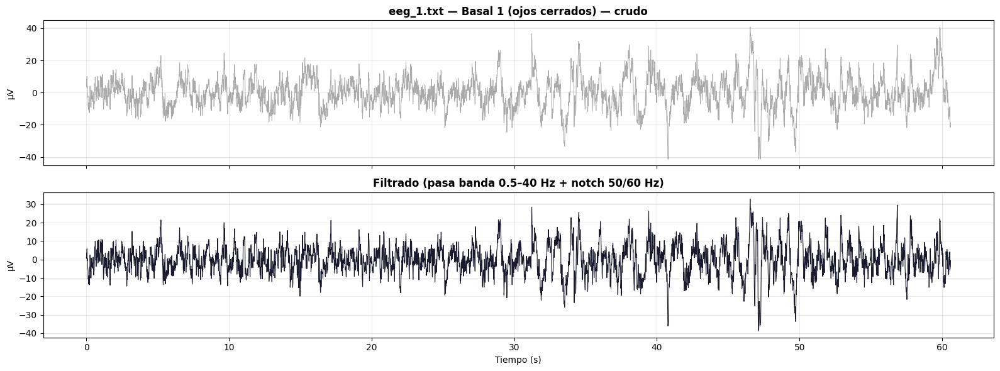</td>
    <td>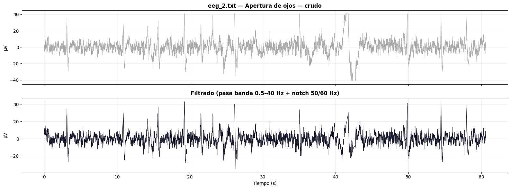</td>
  </tr>
  <tr>
    <td>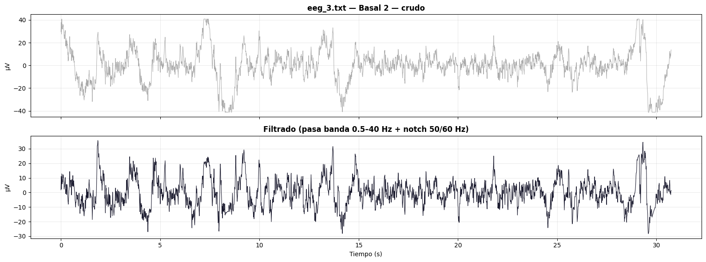</td>
    <td>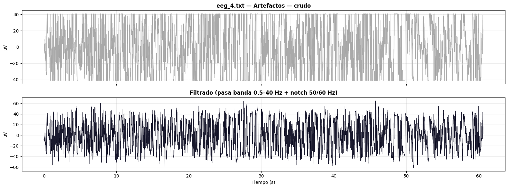</td>
  </tr>
  <tr>
    <td>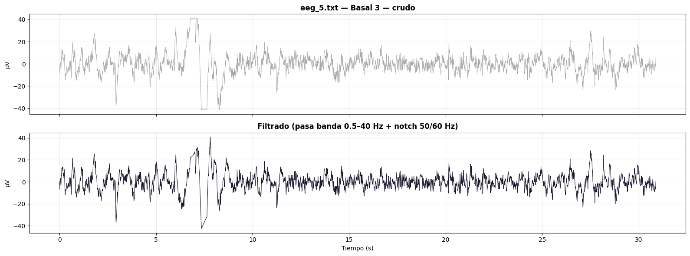</td>
    <td>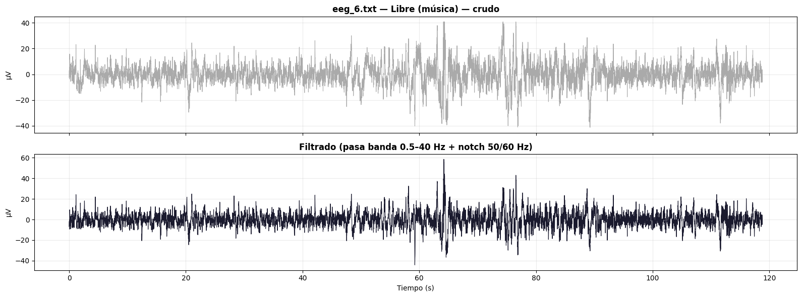</td>
  </tr>
</table>

### 3.2. Curtosis por componente y componentes excluidas

Para cada archivo se calculó la curtosis de las 9 componentes independientes (IC0–IC8) obtenidas tras EMD + ICA. Los componentes con |curtosis| > 5 se marcaron como candidatos a artefacto y fueron excluidos en la reconstrucción:

| Archivo | Curtosis por componente (IC0…IC8) | Componentes excluidas |
|---|---|---|
| eeg_1.txt | 4.070, -1.104, 3.635, 1.594, 2.463, **5.914**, 1.096, 1.931, 0.662 | [5] |
| eeg_2.txt | **7.146**, -0.228, 3.610, 0.276, -0.499, **5.548**, **7.258**, **14.014**, -0.563 | [0, 5, 6, 7] |
| eeg_3.txt | 0.173, 1.283, 2.298, 1.903, 0.737, 3.345, 1.859, 1.725, 2.460 | ninguna |
| eeg_4.txt | -0.687, 0.999, 0.773, 1.018, 2.786, 0.897, 1.314, 1.659, 0.393 | ninguna |
| eeg_5.txt | **12.007**, -1.443, **5.144**, -1.452, 0.089, 2.936, 1.322, **14.588**, **7.801** | [0, 2, 7, 8] |
| eeg_6.txt | 3.173, 0.783, 0.549, **8.306**, 2.304, **7.046**, 1.304, **8.823**, 1.608 | [3, 5, 7] |

Nota: en `eeg_2.txt` y `eeg_4.txt`, FastICA emitió una advertencia de no convergencia (`ConvergenceWarning`), lo cual debe considerarse al interpretar sus resultados.

Llama la atención que, pese a corresponder a la condición explícitamente etiquetada como **"Artefactos"**, el archivo `eeg_4.txt` no presentó ninguna componente con |curtosis| > 5, mientras que `eeg_2.txt` ("Apertura de ojos") fue el registro con más componentes excluidas (4 de 9).

A continuación se muestran las componentes individuales identificadas como candidatas a artefacto (|curtosis| > 5) para los archivos en los que se excluyó al menos una componente:

<table>
  <tr>
    <td>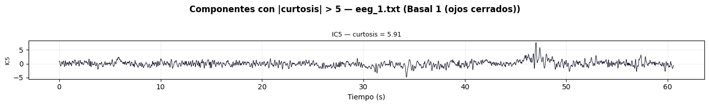</td>
    <td>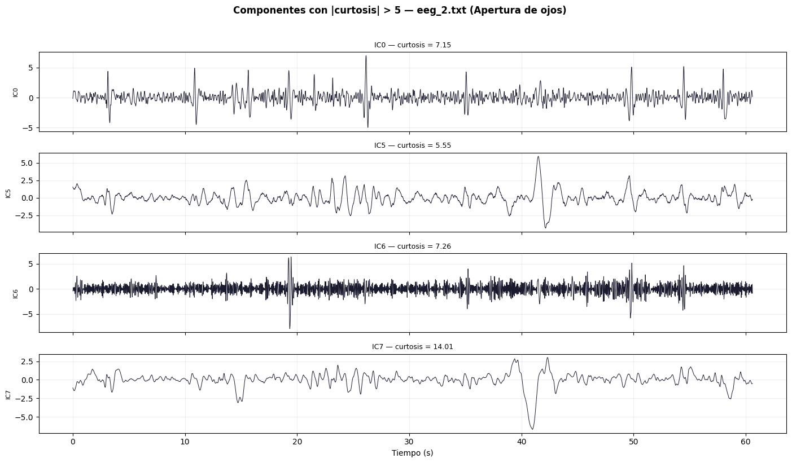</td>
  </tr>
  <tr>
    <td>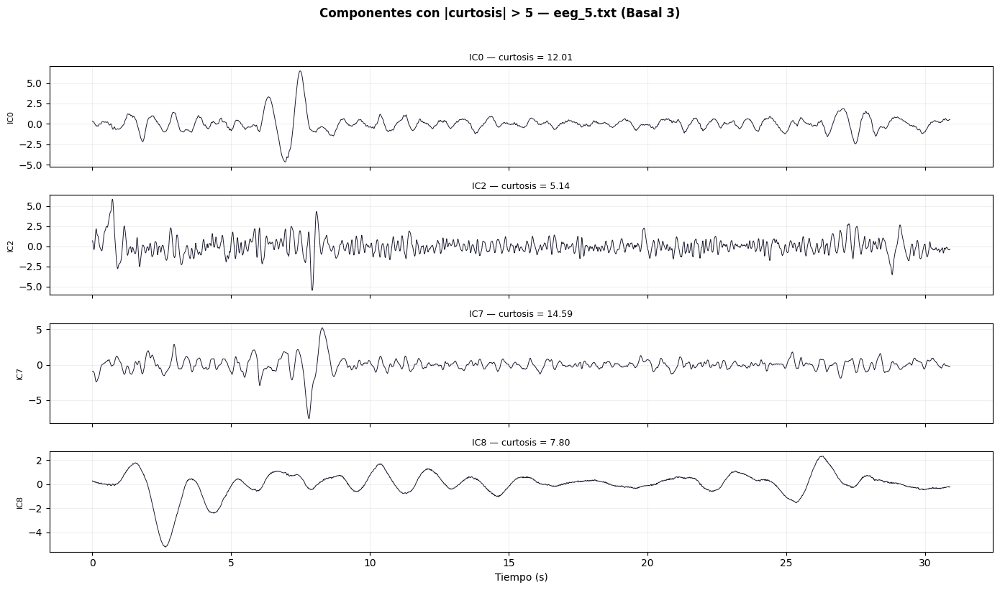</td>
    <td>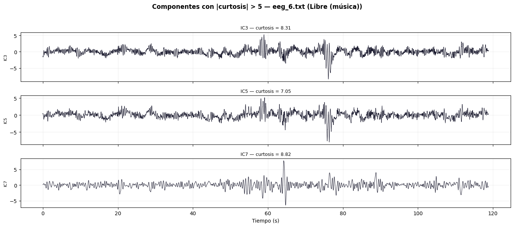</td>
  </tr>
</table>

### 3.3. Señal original vs. señal reconstruida (limpia)

Para cada archivo se comparó la señal filtrada original con la señal reconstruida tras eliminar las componentes con |curtosis| > 5:

<table>
  <tr>
    <td>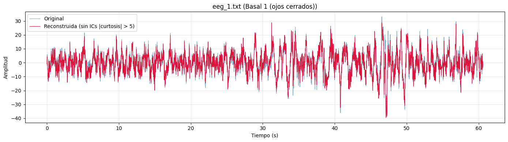</td>
    <td>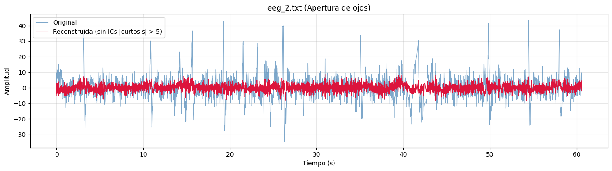</td>
  </tr>
  <tr>
    <td>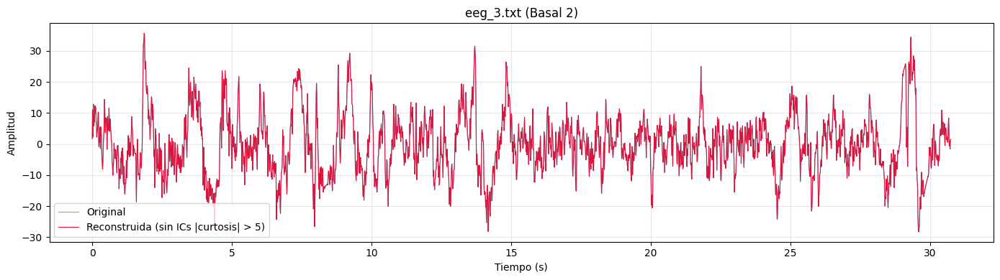</td>
    <td>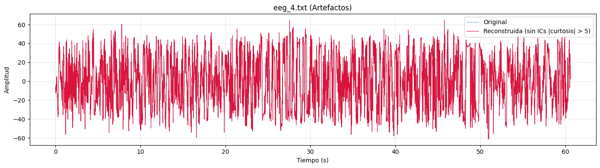</td>
  </tr>
  <tr>
    <td>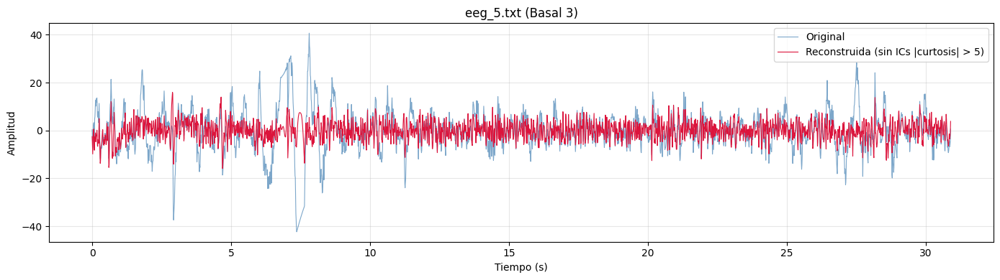</td>
    <td>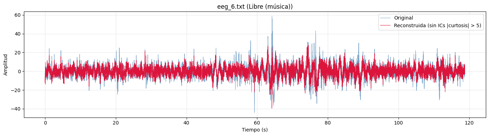</td>
  </tr>
</table>

En `eeg_3.txt` y `eeg_4.txt`, al no haberse excluido ninguna componente, la señal "reconstruida" coincide exactamente con la señal filtrada original.

## 4. Discusión

### 4.1. Sobre el método EMD + ICA con criterio de curtosis

A diferencia de un ICA aplicado directamente sobre múltiples canales de EEG, aquí se utilizó una señal de un solo canal descompuesta en IMFs mediante EMD, que luego se trataron como pseudo-canales de entrada para ICA. Esta estrategia permite aplicar la separación de fuentes independientes incluso con un único canal de registro, aprovechando que EMD ya separa la señal en distintas escalas temporales/oscilatorias.

El uso de la curtosis como criterio de exclusión es coherente con la teoría de ICA, ya que esta técnica busca maximizar la no-gaussianidad de las componentes extraídas, y los artefactos (parpadeos, movimientos musculares, contactos deficientes de electrodo) suelen generar transitorios de gran amplitud que elevan fuertemente la curtosis de la componente en la que se concentran. El umbral empleado (|curtosis| > 5) es un criterio cuantitativo y reproducible, en contraste con la inspección visual empleada en otros enfoques de ICA sobre EEG multicanal [8].

### 4.2. Sobre los resultados por archivo

Los resultados muestran una variabilidad considerable entre condiciones. El archivo `eeg_2.txt` (apertura de ojos) presentó el mayor número de componentes excluidas (4 de 9), varias con curtosis muy elevada (hasta 14.014), lo que es consistente con la aparición de parpadeos y movimientos oculares asociados a la transición de ojos cerrados a ojos abiertos. De forma similar, `eeg_5.txt` mostró componentes con curtosis muy alta (hasta 14.588).

Resulta notable que el archivo `eeg_4.txt`, etiquetado explícitamente como "Artefactos", no presentara ninguna componente con |curtosis| > 5. Esto podría deberse a que los artefactos inducidos en ese registro se distribuyeron de forma más homogénea entre varias componentes (sin concentrarse en una sola con curtosis extrema), a que el criterio de umbral fijo (5) no fue lo suficientemente sensible para ese tipo particular de artefacto, o a la falta de convergencia de FastICA reportada para ese archivo, que puede afectar la calidad de la separación de fuentes.

Los archivos `eeg_1.txt`, `eeg_3.txt`, `eeg_4.txt` y `eeg_6.txt` (condiciones basales o de escucha de música) presentaron, en general, menos componentes excluidas que los registros asociados a movimiento (apertura de ojos), lo cual es consistente con una menor presencia de artefactos musculares y oculares en condiciones de mayor quietud del sujeto.

### 4.3. Limitaciones

El muestreo a 100 Hz limita la posibilidad de aplicar de forma efectiva el filtro notch de 50/60 Hz, ya que ambas frecuencias se ubican en o por encima del límite de Nyquist (50 Hz); esto implica que la interferencia de línea eléctrica en ese rango no pudo ser removida de forma confiable, algo que debe tenerse en cuenta al interpretar la señal filtrada. Asimismo, las advertencias de no convergencia de FastICA en `eeg_2.txt` y `eeg_4.txt` sugieren que, para esos registros, la separación de componentes podría no ser óptima.

## 5. Conclusión

Se implementó un flujo de procesamiento de EEG basado en la descomposición EMD seguida de ICA (FastICA) sobre las IMFs resultantes, utilizando la curtosis como criterio cuantitativo para identificar componentes artefactuales. De los seis registros analizados, cuatro presentaron al menos una componente con |curtosis| > 5, siendo `eeg_2.txt` (apertura de ojos) y `eeg_5.txt` (basal 3) los que mostraron mayor cantidad de componentes candidatas a artefacto y con los valores de curtosis más extremos, mientras que `eeg_3.txt` y `eeg_4.txt` no presentaron ninguna componente por encima del umbral establecido. Este enfoque permitió reconstruir, para cada archivo, una versión de la señal filtrada con las componentes de mayor no-gaussianidad removidas, sentando una base cuantitativa y reproducible para la eliminación de artefactos en registros de EEG de un solo canal.

## 6. Bibliografía

[1] H. Cecotti, M. Eckstein, and B. Giesbrecht, "Single-Trial Classification of Event-Related Potentials in Rapid Serial Visual Presentation Tasks Using Supervised Spatial Filtering," IEEE Transactions on Neural Networks and Learning Systems, vol. 25, no. 11, pp. 2030-2042, 2014, doi: 10.1109/TNNLS.2014.2302898.

[2] S. Boudet, L. Peyrodie, G. Forzy, A. Pinti, H. Toumi, and P. Gallois, "Improvements of Adaptive Filtering by Optimal Projection to filter different artifact types on long duration EEG recordings," Computer Methods and Programs in Biomedicine, vol. 108, no. 1, pp. 234-249, 2012, doi: 10.1016/j.cmpb.2012.04.005.

[3] A. Napoli and I. Obeid, "Combined Common Spatial Pattern and spectral filtering for EEG-based BCIs," in 2011 5th International IEEE/EMBS Conference on Neural Engineering, 2011, pp. 449-452, doi: 10.1109/NER.2011.5910583.

[4] A. Hyvärinen, "Fast and robust fixed-point algorithms for independent component analysis," IEEE Transactions on Neural Networks, vol. 10, no. 3, pp. 626-634, 1999, doi: 10.1109/72.761722.

[5] M. Divjak, D. Zazula, and A. Holobar, "Assessment of artefact suppression by ICA and spatial filtering on reduced sets of EEG signals," in 2011 Annual International Conference of the IEEE Engineering in Medicine and Biology Society, 2011, pp. 4422-4425, doi: 10.1109/IEMBS.2011.6091097.

[6] C. Brunner, M. Naeem, R. Leeb, B. Graimann, and G. Pfurtscheller, "Spatial filtering and selection of optimized components in four class motor imagery EEG data using independent components analysis," Pattern Recognition Letters, vol. 28, no. 8, pp. 957-964, 2007, doi: 10.1016/j.patrec.2007.01.002.

[7] G. Rilling, P. Flandrin, and P. Gonçalves, "On empirical mode decomposition and its algorithms," in IEEE-EURASIP Workshop on Nonlinear Signal and Image Processing, 2003.

[8] Dhani Dharmaprani, H. K. Nguyen, T. W. Lewis, D. DeLosAngeles, J. O. Willoughby, and K. J. Pope, "A comparison of independent component analysis algorithms and measures to discriminate between EEG and artifact components," PubMed, Aug. 2016, doi: https://doi.org/10.1109/embc.2016.7590828.
