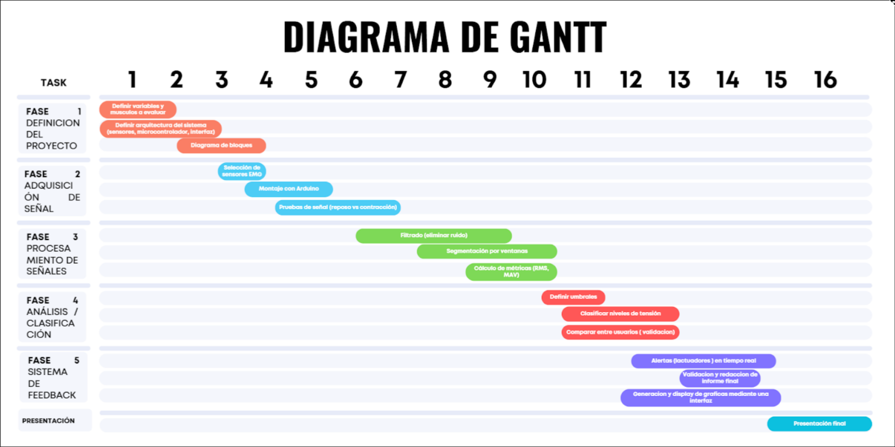

# Proyecto final - Análisis de tensión muscular durante el uso prolongado de laptop

## Introducción

## Problemática

El uso prolongado de computadoras y laptops se ha incrementado significativamente en los últimos años, especialmente en estudiantes y trabajadores que realizan actividades sedentarias durante varias horas al día. Se ha evidenciado que el comportamiento sedentario prolongado (≥ 6 horas diarias) incrementa significativamente el riesgo de desarrollar dolor cervical, alcanzando hasta un 88% más en comparación con personas no sedentarias, siendo el uso de computadoras uno de los factores principales asociados [1].

Diversos estudios epidemiológicos indican que los estudiantes universitarios presentan una alta prevalencia de dolor musculoesquelético, especialmente en la región cervical y de hombros. Investigaciones recientes han reportado que más del 40% de los estudiantes presentan antecedentes de trastornos musculoesqueléticos, mientras que el dolor cervical puede alcanzar prevalencias de hasta 66% en periodos cortos, evidenciando la alta frecuencia de este problema en esta población. Asimismo, se ha identificado que factores como el uso prolongado de dispositivos electrónicos, la postura del cuello y el tiempo de exposición constituyen variables significativamente asociadas con la aparición de estos trastornos [2].

En poblaciones jóvenes, como estudiantes universitarios, la situación resulta aún más preocupante. Un metaanálisis reciente ha evidenciado que el incremento en el uso de dispositivos digitales y el aprendizaje virtual se asocia con un aumento significativo en la prevalencia de dolor cervical, principalmente debido a posturas inadecuadas y al uso prolongado de computadoras [3].

Además, el uso específico de laptops implica un mayor riesgo ergonómico debido a su diseño, ya que obliga a adoptar posturas con flexión del cuello y elevación de los hombros. Estudios experimentales han demostrado que el uso de laptops en superficies no ergonómicas, como camas o sofás, incrementa significativamente la flexión cervical (hasta aproximadamente 18°), lo que se asocia con la aparición de dolor en cuello y espalda superior [4].

## Propuesta de solución
Nuestra propuesta de solución es un sistema que capta las señales electromiográficas para el monitoreo de la tensión muscular en usuario durante el uso prolongado de laptops, teniendo como objetivo identificar patrones que nos indique fatiga, sobrecarga en músculos que actúan durante estas prácticas y malas posturas en situaciones reales. Haremos la adquisición de datos y análisis de las señales musculares en múltiples usuarios, esto nos permitirá observar cómo varía la respuesta muscular entre usuarios e identificar señales de sobrecarga. A  partir de estos datos, implementaremos un sistema con retroalimentación en tiempo real y reportes posteriores, contribuyendo a la detección de condiciones de riesgo musculoesquelético.

Además, procesaremos las señales obtenidas que nos van a permitir diferenciar estados de baja, media y alta tensión muscular, así como la identificación de patrones. Esta información será integrada en una aplicación tanto en el celular como en la laptop, que brindará retroalimentación al usuario mediante alertas y visualización interactiva de métricas, ayudando en  la corrección postural durante el trabajo prolongado.

## Plan de actividades

Fase 1: Definición del proyecto
Se decide qué se va a medir, qué músculos se van a evaluar y cómo será el sistema. También se hace un esquema general del funcionamiento.

Fase 2: Adquisición de señal
Se eligen los sensores y se realizan pruebas para obtener las señales del músculo en distintas condiciones, como reposo y contracción.

Fase 3: Procesamiento de señales
Se limpian las señales para quitar ruido, se dividen en partes y se calculan valores que indiquen la tensión muscular.

Fase 4: Análisis y clasificación
Se establecen rangos para la señal, se clasifican los niveles de tensión y se comparan resultados entre diferentes personas.

Fase 5: Sistema de feedback
Se crean alertas en tiempo real y una interfaz para mostrar los resultados. También se ajusta el sistema y se prepara el informe final.

Presentación
Se muestra el proyecto terminado y se explican los resultados obtenidos.

## Referencias
[1] Y. Meng et al., “The associations between sedentary behavior and neck pain: A systematic review and meta-analysis,” BMC Public Health, vol. 25, 2025.
https://link.springer.com/article/10.1186/s12889-025-21685-9

[2] G. Kandasamy et al., “Prevalence of musculoskeletal pain among undergraduate students,” Frontiers in Medicine, vol. 11, 2024
https://www.frontiersin.org/journals/medicine/articles/10.3389/fmed.2024.1403267/full

[3] K. Gao et al., “Prevalence of neck pain and its associated factors among university students: A systematic review and meta-analysis,” BMC Public Health, vol. 23, 2023.
https://link.springer.com/search?query=Risk+factors+for+neck+pain+in+college+students%3A+a+systematic+review+and+meta-analysis

[4] M. Intolo, M. Shaphe, and S. Reddy, “Analysis of neck and shoulder posture and muscle activity during laptop use on different surfaces,” Applied Ergonomics, vol. 79, pp. 1–7, 2019.
https://pubmed.ncbi.nlm.nih.gov/31256105/
