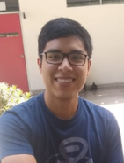
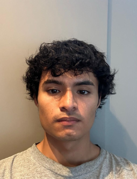

# Peru libre
## Bienvenidos al repositorio del Grupo 6
<iframe title="vimeo-player" src="https://player.vimeo.com/video/124684393?h=a3fc5713b9" width="640" height="360" frameborder="0" referrerpolicy="strict-origin-when-cross-origin" allow="autoplay; fullscreen; picture-in-picture; clipboard-write; encrypted-media; web-share"   allowfullscreen></iframe>

Curso: **Introducción a Señales Biomédicas 2026-I**

Este espacio ha sido creado con el propósito de documentar el desarrollo de nuestro proyecto académico, así como los conocimientos adquiridos durante el estudio de la adquisición, procesamiento y análisis de señales biomédicas.

A lo largo del curso trabajaremos con herramientas de programación, instrumentación electrónica y técnicas de procesamiento digital de señales para comprender el funcionamiento de diferentes sistemas biomédicos. En este repositorio se registrarán los avances del proyecto, códigos fuente, reportes, resultados experimentales y documentación técnica generada por el equipo.

Nuestro objetivo es aplicar los conceptos aprendidos en clase para desarrollar soluciones tecnológicas orientadas al área de la salud, fortaleciendo competencias en ingeniería biomédica, análisis de datos y diseño de sistemas de adquisición de bioseñales.

### Integrantes del Equipo

| FOTO | PRESENTACIÓN |
|------|--------------|
|  | **ALLEN STIRS CHAVEZ RIVAS** <allen.chavez@upch.pe>  **Acerca de mí:** A la fecha del 2026, soy estudiante de pregrado de la carrera de Ingeniería Biomédica PUCP-UPCH del 7mo ciclo. Tengo un profundo interés en las áreas de ingeniería de tejidos y biomateriales; también, me interesa los ámbitos de investigación e industria dentro de mi carrera. Adicionalmente, tengo interés en participar en proyectos de diferentes ramas y así ampliar mis conocimientos en esta amplia carrera. Decidí estudiar Ingeniería Biomédica para ayudar a las personas a poder ampliar su acceso a la salud y a la par mejorar los sistemas de salud. |
|  | **LUIS PLASENCIA** <luis.plasencia@upch.edu.pe>  **Acerca de mí:** A la fecha del 2026, soy estudiante de pregrado de la carrera de Ingeniería Biomédica PUCP-UPCH del 7mo ciclo. Tengo un profundo interés en las áreas de ingeniería clínica, dispositivos médicos, biomecánica, procesamiento de señales e investigación biomédica. Además, me interesa el diseño mecánico, la programación y la aplicación de la ingeniería para resolver problemas reales del sistema de salud. Decidí estudiar Ingeniería Biomédica con el objetivo de contribuir al desarrollo de tecnologías que mejoren la calidad de vida de las personas y el acceso a la atención médica. |
|  | **ANDRÉ ALEXIS PALOMINO MOZO** <andre.palomino@upch.pe>  **Acerca de mí:** A la fecha del 2026, soy estudiante de pregrado de la carrera de Ingeniería Biomédica PUCP-UPCH del 7mo ciclo. Tengo un profundo interés en las áreas de ingeniería de tejidos y biomateriales, señales e imágenes e ingeniería clínica; también, me interesa los ámbitos de investigación e industria dentro de mi carrera. Adicionalmente, tengo interés en matemáticas puras y aplicadas. Decidí estudiar Ingeniería Biomédica para ayudar a las personas y mejorar los sistemas de salud. |
|  | **Leonardo Macchiavello** <correo@ejemplo.com>  **Acerca de mí:** A la fecha del 2026, soy estudiante de pregrado de la carrera de Ingeniería Biomédica. Tengo un profundo interés en las áreas de tecnología médica, innovación en salud, procesamiento de señales y desarrollo de dispositivos biomédicos. Asimismo, me interesan la investigación y la aplicación de la ingeniería para resolver problemas reales en el ámbito sanitario. Decidí estudiar Ingeniería Biomédica porque me motiva contribuir al desarrollo de soluciones tecnológicas que mejoren la calidad de vida de las personas y fortalezcan los sistemas de salud. |
|  | **ALESSANDRO FELIX** <alessandro.felix@upch.pe>  **Acerca de mí:** Me apasiona el uso de la ingeniería para comprender y resolver problemas complejos relacionados con la salud. Actualmente curso el séptimo ciclo de Ingeniería Biomédica PUCP-UPCH y tengo especial interés en el procesamiento digital de señales, la biomecánica, el modelado de sistemas y los biomateriales. Disfruto participar en proyectos que combinen análisis, diseño e innovación, especialmente aquellos que representan retos técnicos y oportunidades de aprendizaje. |

### Profesores del curso

- Moisés Stevend Meza Rodriguez
- José Alonso Caceres Del Aguila